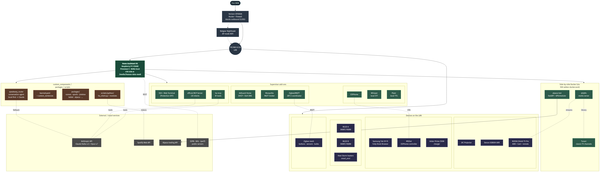

# Speakeasy Home Assistant

Public mirror of the Home Assistant config + supporting services that run a
home-theater / smart-room build called **Speakeasy**. The live install runs on a
Raspberry Pi 5 (Pironman 5 case, NVMe boot) with Home Assistant OS, ~30 HA add-ons,
custom Python scripts, ESPHome devices, a Zigbee2MQTT mesh, and a deterministic
Alpaca trading bot deployed as a Docker container alongside HA.

This repo is meant to be **reference, not a clone-and-go install** — it's a
working real-world setup, with private bits (tokens, MQTT password, Zigbee
network key, ADB keys, TLS certs, HA `.storage/`, SQLite history DB, backups)
scrubbed or excluded. See [Setting up Home Assistant from scratch](#setting-up-home-assistant-from-scratch)
below for the generic install path.



> _Full-resolution: [`docs/architecture.png`](docs/architecture.png) · source:
> [`docs/architecture.mmd`](docs/architecture.mmd)_

## Repo layout

```
.
├── README.md              ← you are here
├── ALPACA_BOT.md          ← the Alpaca trading bot (formerly README.md)
├── SETUP_GUIDE.md         ← Alpaca-bot deploy walkthrough
├── Dockerfile             ← Alpaca-bot container
├── pyproject.toml         ← Alpaca-bot deps
├── src/                   ← Alpaca-bot Python source
├── .env.example           ← Alpaca-bot config template
│
├── config/                ← Home Assistant /config snapshot
│   ├── configuration.yaml
│   ├── automations.yaml
│   ├── scripts.yaml
│   ├── scenes.yaml
│   ├── sensors.yaml
│   ├── packages/         ← feature bundles (one yaml per feature area)
│   ├── scripts/          ← shell + python scripts called via shell_command
│   │   └── python/       ← Python migration (ha_client.py helper + modules)
│   ├── custom_sentences/ ← local-matcher learned phrases + custom intents
│   ├── dashboards/       ← yaml-mode Lovelace dashboards
│   ├── esphome/          ← M5Dial + ESP firmware configs (secrets stripped)
│   ├── custom_components/speakeasy_router/  ← custom conversation agent
│   ├── themes/           ← Lovelace themes
│   ├── blueprints/       ← automation blueprints
│   ├── www/              ← Lovelace static assets (HACS-managed dirs excluded)
│   └── zigbee2mqtt/      ← Z2M config (network key + password placeholders)
│
└── docs/
    ├── architecture.mmd   ← Mermaid source for the diagram
    └── architecture.png   ← rendered PNG
```

## What's actually deployed here

- **Hardware**: Raspberry Pi 5 (8GB) in a Pironman 5 case, NVMe boot, 4TB
  USB ext4 drive at `/media/hassos-data-medi` for media.
- **OS**: Home Assistant OS (HAOS).
- **Add-ons** (Supervisor):
  - AdGuard Home — DHCP + DNS for the entire LAN, DoH-only upstream
  - Mosquitto — MQTT broker
  - Zigbee2MQTT — Zigbee mesh via a Nabu Casa ZBT-2 coordinator
  - ESPHome — for the M5Dial controller
  - Whisper + Piper + Wyoming — local STT/TTS for the voice assistant
  - Frenck's "Advanced SSH & Web Terminal" — SSH with Protection mode off
    so Docker socket access works
  - HA-MCP — an MCP server that bridges Claude Code to HA
  - ha-mcp + official MCP server — dual MCP bridges for the conversation agent
- **Integrations**: Spotify (SpotifyPlus + native), JVC projector, Denon AVR,
  NVIDIA Shield (3 integrations + universal media_player), AndroidTV/ADB,
  Anker Solix (Prime 250W charger), Smart Envi (Heat Storm wall heaters), WLED
  (2× SK6812 strips), Z-Wave (planned, Lockly U-Bolt Pro), iperf3 capacity
  sensor.
- **Custom services on Docker** (outside Supervisor, deployed via SSH addon's
  docker.sock):
  - Tunarr — classic-TV channel maker, points at Jellyfin
  - Jellyfin — media server
  - Alpaca trading bot — see [`ALPACA_BOT.md`](ALPACA_BOT.md)
- **Voice pipeline**: VPE → Whisper → custom `speakeasy_router` conversation
  agent → either local-matched phrase (`learned.yaml`) or Claude (Haiku 4.5
  via `mcp__homeassistant__*` tools) → Piper TTS.
- **Devices**: M5Dial (ESPHome), Samsung Tab S9 FE wall tablet (Fully Kiosk
  Browser), Mushroom-strategy dashboard, JVC projector, Denon X3800H,
  NVIDIA Shield TV Pro.
- **HACS**: ~10 frontend cards (mushroom, button-card, bubble-card, card-mod,
  mushroom-strategy, browser_mod), plus custom integrations (anker_solix,
  smart_envi, spotifyplus).

For the live device map, see the diagram above.

## Setting up Home Assistant from scratch

This is the generic happy-path. Once HA is up, you can pull what you want from
this repo's `config/` tree as reference.

### 1. Pick hardware

Anything that supports HAOS. Most common:

- **Raspberry Pi 4 (4GB or 8GB)** — fine for a starter setup of 20-50 devices.
  Use an SSD over a microSD card; SD cards die from HA's constant writes
  within 6-12 months.
- **Raspberry Pi 5 (8GB) + NVMe HAT** (Pironman 5 case is a nice all-in-one) —
  what's running here. Comfortable headroom for 100+ entities, lots of
  add-ons, ESPHome compiles, voice pipeline, and a few extra Docker services.
- **HA Green / HA Yellow** — official appliances from Nabu Casa, plug-and-play.
- **Mini-PC** (Intel N100/N305) — overkill for most homes but cheap and
  silent.

You'll also want a Zigbee or Z-Wave coordinator on day 1 if you have any
mesh devices. The Nabu Casa **ZBT-2** (Zigbee) and **ZST39 LR** (Z-Wave)
are the easy buttons.

### 2. Install HAOS

Follow the official guide: <https://www.home-assistant.io/installation/>

Short version:

1. Download the HAOS image for your hardware from the link above.
2. Flash it with [Raspberry Pi Imager](https://www.raspberrypi.com/software/)
   or [Balena Etcher](https://etcher.balena.io/). Pi Imager has HAOS as a
   first-class option under "Other specific-purpose OS" → "Home assistants".
3. Boot from the image. First boot takes 10-20 min as HAOS pulls the supervisor
   and core containers.
4. Open `http://homeassistant.local:8123` (or the device's IP if mDNS doesn't
   resolve — this is common on segmented networks). Walk through the onboarding
   wizard: account, location, units.

You now have a working HA. Hello.

### 3. Add the SSH & Web Terminal add-on (Protection OFF)

This is the single most useful add-on for any non-trivial install. From the
sidebar:

1. **Settings → Add-ons → Add-on Store → "Advanced SSH & Web Terminal"**
   (by Frenck — *not* the official "SSH" add-on, which is more locked down).
2. Configure it: set a password or SSH key, set `apks: [openssh-client, rsync, jq, python3]`,
   set `init_commands: []`.
3. Turn **Protection mode OFF** under the add-on's Info tab. This is what gets
   you access to `/var/run/docker.sock` so you can run arbitrary Docker
   containers later (Tunarr, Jellyfin, the alpaca bot, etc.).
4. **Start** the add-on, enable **Start on boot** and **Watchdog**.
5. SSH in: `ssh root@<HA_IP> -p 22222`. Add a host alias in your
   `~/.ssh/config`:
   ```
   Host myha
     HostName <HA_IP>
     User root
     Port 22222
     IdentityFile ~/.ssh/id_ed25519
   ```

### 4. Pick a coordinator for mesh devices

If you have Zigbee or Z-Wave devices:

- **Zigbee**: install **Zigbee2MQTT** add-on + **Mosquitto** add-on. Plug
  in your coordinator (ZBT-2, Sonoff dongle, ConBee II — anything supported by
  zigbee-herdsman). For the ZBT-2 specifically, you **must** set
  `baudrate: 460800` and `rtscts: true` in the Z2M serial config (defaults
  fail). See [`config/zigbee2mqtt/configuration.yaml`](config/zigbee2mqtt/configuration.yaml)
  in this repo for the working values.
- **Z-Wave**: install **Z-Wave JS UI** add-on. The Nabu Casa ZST39 LR is
  the recommended Z-Wave stick now that Aeotec stopped making the Z-Stick.

If you don't have mesh devices, skip this step.

### 5. (Optional) Make HA your network's DNS + DHCP

If you want network-wide ad blocking, install the **AdGuard Home** add-on:

1. Configure AdGuard to listen on port 53 and serve DHCP.
2. Disable DHCP on your router (otherwise you'll have two servers handing out
   leases and a bad time).
3. Set AdGuard's upstream to a DoH provider (`https://dns.quad9.net/dns-query`
   or similar) — this stops your ISP from snooping plaintext DNS.
4. Block outbound port 53 + 853 on your firewall to enforce DoH. If your router
   can't do this, smart TVs and IoT junk will silently bypass AdGuard by
   talking directly to Google's 8.8.8.8.

This is exactly the "Plan B-Plus" setup running here. There's a memory entry
on the gotchas: Verizon CR1000A routers have a wedge bug where blocking 53
to the gateway itself confuses the firewall — block 53 only to non-router
destinations.

### 6. Useful first-day integrations

These are the ones that show up in nearly every "I just got HA" thread:

- **Mobile App** (iOS or Android) → gives you presence detection, push
  notifications, and a way to send actionable buttons from the app.
- **HACS** ([install guide](https://www.hacs.xyz/docs/use/)) → unofficial
  package manager for community frontend cards and integrations. You'll want
  it.
- **Mushroom** (via HACS) → the prettiest set of Lovelace cards. Pair with
  the **Mushroom Strategy** dashboard from `DigiLive/mushroom-strategy` for
  auto-generated dashboards based on your area registry.
- **Spotify** (or your music service) → native integration is fine, but
  **SpotifyPlus** (via HACS) is much richer if you want to do anything beyond
  play/pause from HA.
- **ESPHome** (add-on) → if you ever want to flash an ESP32 dev board (M5Dial,
  M5Stamp, generic ESP32) to be a custom controller/sensor/display, this is
  the path. Zero firmware writing required; the configs are yaml.

### 7. Organize your config

After the first few weeks you'll have a sprawling `configuration.yaml`. Some
hygiene that pays for itself:

- Use **packages** (split `configuration.yaml` into `packages/<feature>.yaml`).
  Move each feature area into its own file. This repo's `config/packages/`
  shows ~14 working examples (scenes, sports, jukebox, tablet, alpaca, etc).
- Pin a **theme** — easier on the eyes than the default.
- Run automations through **input_boolean**/**input_select** helpers so you
  can toggle behaviors from a dashboard without editing yaml.
- For anything that needs more than 3-4 lines of Jinja, write a
  **shell_command** that calls a Python script. This repo's
  `config/scripts/python/` shows the pattern: `ha_client.py` is a thin
  REST wrapper, and each script imports from it. The shell_command goes in
  `configuration.yaml`; a yaml script in `scripts.yaml` (or a package) wraps
  it with `fields:` for UI input.

### 8. Backups

HA Supervisor has built-in backups. **Use them.** Schedule weekly + before
every big change. If you set up Nabu Casa (cloud), you get offsite backups
free.

For the obsessive: also rsync `/config` periodically to another machine. The
SQLite history DB at `/config/home-assistant_v2.db` grows fast — exclude it
from rsync unless you specifically want history.

### 9. What to crib from this repo

Probably useful as starter material:

- [`config/configuration.yaml`](config/configuration.yaml) — packages,
  template, lovelace dashboards, and a working `universal` media_player that
  wraps Cast + androidtv_remote + ADB into one entity for an NVIDIA Shield.
- [`config/packages/speakeasy_scenes.yaml`](config/packages/speakeasy_scenes.yaml) —
  activity-based scene system using `input_select` as the state machine.
  Replace activities with whatever fits (movie/music/game/off in this case).
- [`config/scripts/python/ha_client.py`](config/scripts/python/ha_client.py) —
  drop-in helper for any Python shell_command that needs to call HA back.
  Reads `/config/.ha_token`, hits HA Core REST directly.
- [`config/custom_sentences/en/learned.yaml`](config/custom_sentences/en/learned.yaml) —
  example of teaching the local matcher new phrases so they don't round-trip
  to the LLM every time.
- [`config/dashboards/`](config/dashboards/) — yaml-mode dashboards (mushroom
  auto-generated, plus alpaca, adguard, and a custom speakeasy one).

Probably **not** useful as-is unless you happen to have the same hardware:

- `config/packages/tablet_kiosk.yaml` — assumes a Fully Kiosk Browser tablet.
- `config/packages/sports.yaml` — assumes Bills + Sabres fan.
- `config/scripts/python/celebrate.py` — WLED hockey-goal light show.
- `config/esphome/speakeasy-dial.yaml` — M5Dial-specific.

## Security notes for forks / clones

Before pushing anything that includes `config/` from a real install:

1. Delete `secrets.yaml` (or any file named `secrets.*`).
2. Delete `.storage/` — this contains auth tokens, integration OAuth tokens,
   webhook IDs, area registry, all the PII.
3. Delete `.ha_token`, `.HA_VERSION`, `.cloud`, `.uuid`.
4. Delete `home-assistant_v2.db*` — history with full state.
5. Delete `backups/`, `deps/`, `tts/`, `__pycache__/`, `*.log*`.
6. Delete `androidtv_adbkey*`, any `*.pem` / `*.crt` / `*.key`.
7. Delete `zigbee2mqtt/database.db*` (device link keys) and
   `coordinator_backup.json`.
8. Open `zigbee2mqtt/configuration.yaml` and scrub `password`, `network_key`,
   `pan_id`, `ext_pan_id`.
9. Grep for `password:`, `api_key`, `token`, `bearer` and replace any
   plaintext with `!secret` references.
10. Check Fully Kiosk URLs and similar for embedded `password=` params.

The `tar` command I used to pull this snapshot is in the commit message of
the first commit that added `config/`, if you want to mirror the approach.

## The alpaca trading bot

Lives at the repo root (because it predates this README). Full writeup in
[`ALPACA_BOT.md`](ALPACA_BOT.md), full deploy guide in
[`SETUP_GUIDE.md`](SETUP_GUIDE.md). The HA-side wiring (sensors + dashboard
+ notifications) is in [`config/packages/alpaca_bot.yaml`](config/packages/alpaca_bot.yaml)
and [`config/dashboards/alpaca.yaml`](config/dashboards/alpaca.yaml).

## License

Personal config — provided as reference under the MIT terms in the
alpaca-bot source. Use whatever's useful, attribute or not, no warranty.
